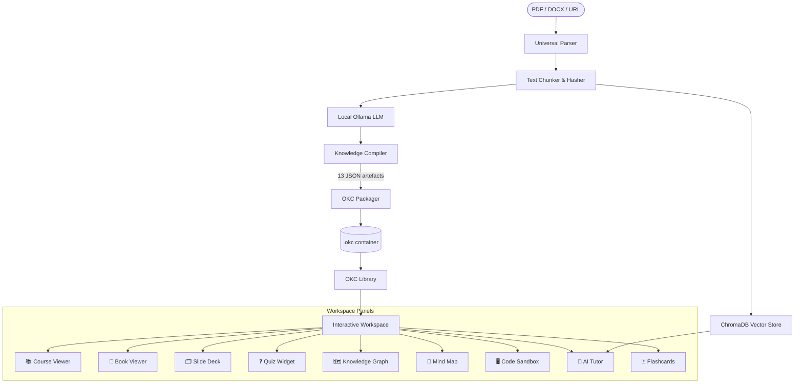

# 📚 Open Knowledge Compiler (OKC)

> **Transform any learning material into a fully structured, interactive knowledge environment — entirely offline, powered by local AI.**

Open Knowledge Compiler is an open-source, privacy-first learning platform that ingests raw documents (PDFs, DOCX, URLs) and compiles them into **`.okc` containers** — self-contained, portable learning environments packed with auto-generated courses, books, slide decks, quizzes, mind maps, knowledge graphs, code sandboxes, and an AI tutor — all without sending a single byte to the cloud.

---

## ✨ Features at a Glance

| Feature | Description |
|---|---|
| 📥 **Universal Parser** | Ingest PDFs, DOCX files, and web URLs into clean text chunks |
| 🧠 **Local AI Compiler** | Uses Ollama (LLaMA 3, Mistral, etc.) to structure raw knowledge |
| 📦 **`.okc` Containers** | Portable ZIP archives containing 13 structured JSON artefacts |
| 🎓 **Auto-Generated Course** | Modular lessons with objectives, content, and hands-on labs |
| 📖 **Interactive Book** | Full chapter-by-chapter book with glossary and appendices |
| 🗂️ **Slide Decks** | Presenter slides with speaker notes and Mermaid diagrams |
| ❓ **Adaptive Quiz Engine** | MCQ, true/false, fill-in-the-blank, coding & reasoning questions |
| 🗺️ **Knowledge Graph** | Concept prerequisite & relationship graph visualisation |
| 🧩 **Mind Map** | Hierarchical topic tree for fast mental model building |
| 🕐 **Timeline** | Chronological event viewer for historical or sequential content |
| 🖥️ **Code Sandbox** | Live Python & JavaScript code runner (subprocess-backed) |
| 🤖 **AI Tutor** | 5 persona modes — Teacher, Mentor, Research Guide, Code Reviewer, Exam Trainer |
| 🃏 **Spaced Repetition Flashcards** | SM-2 algorithm flashcards for active recall revision |
| 📊 **Learning Progress Tracker** | Persistent per-element completion and quiz score tracking |

---

## 🏗️ Architecture



---

## 📦 The `.okc` Container Format

Every compilation produces a portable `.okc` file (a ZIP archive) containing exactly **13 structured JSON artefacts**:

| File | Schema | Contents |
|---|---|---|
| `metadata.json` | `OKCMetadata` | ID, title, author, version, source file hashes |
| `knowledge.json` | `OKCPrimaryKnowledge` | Topics, definitions, facts, prerequisites, key takeaways |
| `graph.json` | `OKCGraph` | Concept nodes and prerequisite/relationship edges |
| `citations.json` | `OKCCitations` | Source snippets with page/line references |
| `course.json` | `OKCCourse` | Modules → Lessons → Labs hierarchy |
| `book.json` | `OKCBook` | Chapters, glossary, appendices |
| `slides.json` | `OKCSlides` | Slide decks with bullets, notes, Mermaid diagrams |
| `quiz.json` | `OKCQuiz` | Questions with type, options, answer, explanation |
| `projects.json` | `OKCProjects` | Hands-on projects with tasks, starter code, test cases |
| `simulation.json` | `OKCSimulation` | Self-contained HTML+CSS+JS canvas visualisations |
| `timeline.json` | `OKCTimeline` | Chronological events with dates and descriptions |
| `mindmap.json` | `OKCMindMap` | Hierarchical node tree rooted at topic root |
| `revision.json` | `OKCRevision` | SM-2 spaced repetition flashcards |

---

## 🛠️ Technology Stack

### Backend

| Package | Version | Role |
|---|---|---|
| FastAPI | 0.111.0 | REST API gateway |
| Uvicorn | 0.30.1 | Async ASGI server |
| SQLModel | 0.0.19 | ORM + Pydantic-integrated SQLite models |
| Pydantic | 2.7.4 | Schema validation for all OKC artefacts |
| PyMuPDF | 1.24.5 | PDF text extraction |
| python-docx | 1.1.2 | DOCX parsing |
| BeautifulSoup4 | 4.12.3 | HTML/URL content scraping |
| sentence-transformers | 3.0.1 | Local embedding generation (all-MiniLM-L6-v2) |
| LiteLLM | 1.40.0 | Unified Ollama API adapter |
| Instructor | 1.3.3 | Structured JSON extraction from LLM output |
| NetworkX | 3.3 | Semantic knowledge graph construction |
| python-multipart | 0.0.9 | File upload handling |
| aiofiles | 23.2.1 | Async file I/O |

### Frontend

| Package | Version | Role |
|---|---|---|
| Next.js | 16 | App Router framework |
| React | 19 | UI component engine |
| TypeScript | 5 | Strict type safety |
| Tailwind CSS | 4 | Utility-first dark mode design |
| Framer Motion | 12 | Fluid page and panel animations |
| Monaco Editor | 4 | VS Code-grade in-browser code editor |
| D3.js | 7 | Knowledge graph & mind map SVG rendering |
| Lucide React | 1 | Consistent icon set |
| clsx + tailwind-merge | — | Conditional class composition |

### Local AI

| Component | Default | Notes |
|---|---|---|
| **Inference engine** | Ollama | Runs fully offline |
| **Default model** | `llama3` | Configurable via `LLM_MODEL` env var |
| **Embedding model** | `all-MiniLM-L6-v2` | Fast local semantic search |
| **Vector store** | ChromaDB | Persisted to `backend/data/chroma/` |

---

## 📂 Project Structure

```
Build Open Knowledge Compiler/
├── backend/
│   ├── app/
│   │   ├── core/
│   │   │   ├── config.py          # Paths, Ollama URL, model names, env vars
│   │   │   └── database.py        # SQLModel engine & session factory
│   │   ├── models/
│   │   │   ├── okc_schema.py      # 13 Pydantic schemas for .okc artefacts
│   │   │   └── db_models.py       # SQLite tables: Library, ChatHistory, Progress
│   │   ├── services/
│   │   │   ├── compiler.py        # KnowledgeCompiler — full compilation pipeline
│   │   │   ├── parser.py          # UniversalParser — PDF, DOCX, URL → chunks
│   │   │   ├── llm.py             # LocalLLMService — Ollama JSON & chat calls
│   │   │   ├── packager.py        # OKCPackager — pack/unpack .okc ZIP archives
│   │   │   ├── graph.py           # SemanticGraphBuilder — topic relationship graph
│   │   │   ├── vector_store.py    # OKCVectorStore — ChromaDB embed & query
│   │   │   └── tutor.py           # OKCTutor — multi-persona RAG tutor agent
│   │   └── main.py                # FastAPI app, routes, background compilation jobs
│   ├── data/
│   │   ├── uploads/               # Uploaded source files (auto-created)
│   │   ├── extracted/             # Unpacked .okc containers (auto-created)
│   │   └── chroma/                # ChromaDB vector index (auto-created)
│   ├── tests/                     # Pytest test suite
│   └── requirements.txt
│
├── frontend/
│   ├── src/
│   │   ├── app/
│   │   │   ├── page.tsx           # Home — upload + library grid
│   │   │   ├── layout.tsx         # Root layout with nav and global fonts
│   │   │   ├── library/           # Library browser page
│   │   │   └── workspace/[id]/    # Dynamic workspace for each .okc package
│   │   ├── components/
│   │   │   ├── BookViewer.tsx     # Chapter reader with glossary sidebar
│   │   │   ├── KnowledgeGraph.tsx # D3 force-directed concept graph
│   │   │   ├── QuizWidget.tsx     # Full quiz engine with scoring & explanations
│   │   │   ├── SimulatorPanel.tsx # HTML simulation iframe sandbox
│   │   │   ├── SlideDeck.tsx      # Keyboard-navigable slide presenter
│   │   │   └── TutorPanel.tsx     # Chat interface with persona selector
│   │   ├── lib/                   # API client utilities
│   │   └── types/                 # Shared TypeScript type definitions
│   ├── next.config.ts
│   ├── tailwind.config.js (via postcss)
│   └── package.json
└── README.md
```

---

## 🚀 Quick Start

### Prerequisites

- **Python 3.10+**
- **Node.js v18+**
- **[Ollama](https://ollama.com)** installed and running locally

### 1. Pull an LLM

```bash
ollama pull llama3
```

> OKC automatically detects any Ollama model you have installed.  
> It falls back to string-parser heuristics if Ollama is offline.

### 2. Start the Backend

```bash
cd backend
pip install -r requirements.txt
python -m uvicorn app.main:app --reload --port 8000
```

### 3. Start the Frontend

```bash
cd frontend
npm install
npm run dev
```

### 4. Open the App

```
http://localhost:3000
```

Interactive Swagger docs are available at `http://localhost:8000/docs`.

---

## 🔌 REST API Reference

All endpoints are served by FastAPI at `http://localhost:8000`.

### `POST /api/compile`
Upload a file and trigger an async background compilation job.

| Field | Type | Description |
|---|---|---|
| `file` | `UploadFile` | PDF, DOCX, or HTML file |
| `title` | `string` | Title for the generated container |
| `author` | `string` | Author name (optional, defaults to "Local Compiler") |

**Response:**
```json
{ "job_id": "job_1720000000", "status": "queued" }
```

---

### `GET /api/compile/status/{job_id}`
Poll compilation progress.

```json
{ "job_id": "job_1720000000", "status": "completed" }
```

Possible status values: `queued` → `processing` → `completed` | `failed: <error>`

---

### `GET /api/library`
Returns all compiled `.okc` packages in the SQLite library.

---

### `GET /api/package/{package_id}`
Loads and returns all 13 artefacts for a specific package in full.

---

### `POST /api/tutor/chat`
Send a message to the AI tutor for a given package.

| Field | Description |
|---|---|
| `package_id` | Target `.okc` package ID |
| `session_id` | Unique chat session identifier |
| `message` | User's question or input |
| `role` | `Teacher` \| `Mentor` \| `Research Guide` \| `Code Reviewer` \| `Exam Trainer` |

---

### `GET /api/tutor/history/{package_id}/{session_id}`
Retrieves full chat history for a session.

---

### `POST /api/progress/update`
Saves user progress for a specific element (lesson, quiz question, flashcard).

---

### `POST /api/run-code`
Executes Python or JavaScript code in a sandboxed subprocess (5-second timeout).

| Field | Description |
|---|---|
| `code` | Source code string |
| `language` | `python` \| `javascript` |

---

## 🤖 AI Tutor Personas

The tutor runs entirely offline via Ollama with 5 switchable personas:

| Persona | Teaching Style |
|---|---|
| 🧑‍🏫 **Teacher** | Breaks down concepts with analogies, asks review questions |
| 🧑‍💼 **Mentor** | Connects topics to real-world applications and career paths |
| 🔬 **Research Guide** | Frames open questions, hypotheses, and academic context |
| 💻 **Code Reviewer** | Critiques logic, efficiency, and style without giving away answers |
| 📝 **Exam Trainer** | Active recall with mock questions and gap analysis |

The tutor uses **RAG (Retrieval-Augmented Generation)** — questions are answered using semantically relevant chunks from the original source, embedded in ChromaDB via `all-MiniLM-L6-v2`.

---

## ⚙️ Configuration

All configuration lives in `backend/app/core/config.py` and is overridable via environment variables:

| Variable | Default | Description |
|---|---|---|
| `OLLAMA_URL` | `http://localhost:11434` | Ollama server base URL |
| `LLM_MODEL` | `ollama/llama3` | LiteLLM model string |
| `EMBEDDING_MODEL_NAME` | `all-MiniLM-L6-v2` | Sentence-transformer model for embeddings |

---

## 🧪 Running Tests

```bash
cd backend
pytest tests/
```

---

## 🤝 Contributing

1. Fork the repository
2. Create a feature branch — `git checkout -b feature/new-artefact-type`
3. Add new artefact schemas to `okc_schema.py`, generate them in `compiler.py`, and render them in the frontend workspace
4. Submit a pull request with a description of what the new panel teaches or visualises

---

## 📄 License

Released under the **MIT License**. See `LICENSE` for details.

---

<p align="center">Built to make knowledge compilation as reproducible as software compilation.</p>
